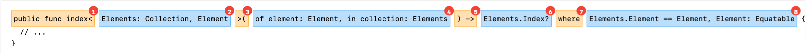
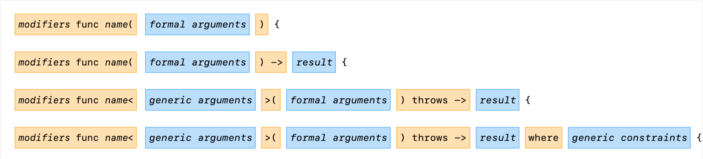
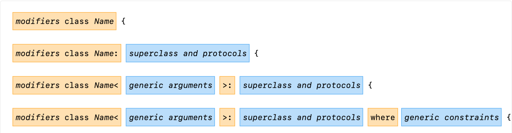

# ScribbleLabApp Swift Style Guidelines

> This style guide is based on Apple’s excellent Swift standard library style and also incorporates feedback from usage across multiple Swift projects within ScribbleLabApp. It is a living document and the basis upon which the formatter is implemented.

## Table of Contents

- Source File Basics
    - File Names
    - File Encoding
    - Whitespace Characters
    - Special Escape Sequences
    - Invisible Characters and Modifiers
    - String Literals
- Source File Structure
    - File Comments
    - Import Statements
    - Type, Variable, and Function Declarations
    - Overloaded Declarations
    - Extensions
- General Formatting
    - Column Limit
    - Braces
    - Semicolons
    - One Statement Per Line
    - Line-Wrapping
        - Function Declarations
        - Type and Extension Declarations
        - Function Calls
        - Control Flow Statements
        - Other Expressions
    - Horizontal Whitespace
    - Horizontal Alignment
    - Vertical Whitespace
    - Parentheses
- Formatting Specific Constructs
    - Non-Documentation Comments
    - Properties
    - Switch Statements
    - Enum Cases
    - Trailing Closures
    - Trailing Commas
    - Numeric Literals
    - Attributes
- Naming
    - Apple’s API Style Guidelines
    - ScribbleLabApp Naming Conventions
    - Naming Conventions Are Not Access Control
    - Identifiers
    - Initializers
    - Static and Class Properties
    - Global Constants
    - Delegate Methods
- Programming Practices
    - Compiler Warnings
    - Initializers
    - Properties
    - Types with Shorthand Names
    - Optional Types
    - Error Types
    - Force Unwrapping and Force Casts
    - Implicitly Unwrapped Optionals
    - Access Levels
    - Nesting and Namespacing
    - guards for Early Exits
    - for-where Loops
    - fallthrough in switch Statements
    - Pattern Matching
    - Tuple Patterns
    - Numeric and String Literals
    - Playground Literals
    - Trapping vs. Overflowing Arithmetic
    - Defining New Operators
    - Overloading Existing Operators
- Documentation Comments
    - General Format
    - Single-Sentence Summary
    - Parameter, Returns, and Throws Tags
    - Apple’s Markup Format
    - Where to Document

## 1. Source File Basics

### 1.1 File Names

All Swift source files end with the extension `.swift`.

In general, the name of a source file best describes the primary entity that it contains. A file that primarily contains a single type has the name of that type. A file that extends an existing type with protocol conformance is named with a combination of the type name and the protocol name, joined with a plus (`+`) sign. For more complex situations, exercise your best judgment.

**For example,**
- A file containing a single type `MyType` is named `MyType.swift`.
- A file containing a type `MyType` and some top-level helper functions is also named `MyType.swift`. (The top-level helpers are not the primary entity.)
- A file containing a single extension to a type `MyType` that adds conformance to a protocol `MyProtocol` is named `MyType+MyProtocol.swift`.
- A file containing multiple extensions to a type `MyType` that add conformances, nested types, or other functionality to a type can be named more generally, as long as it is prefixed with `MyType+`; for example, `MyType+Additions.swift`.
- A file containing related declarations that are not otherwise scoped under a common type or namespace (such as a collection of global mathematical functions) can be named descriptively; for example, `Math.swift`.

### 1.2 File Encoding

Source files are encoded in UTF-8.

### 1.3 Whitespace Characters

Aside from the line terminator, the Unicode horizontal space character (U+0020) is the only whitespace character that appears anywhere in a source file. The implications are:

- All other whitespace characters in string and character literals are represented by their corresponding escape sequence.
- Tab characters are not used for indentation.

### 1.4 Special Escape Sequences

For any character that has a special escape sequence (`\t`, `\n`, `\r`, `\"`, `\'`, `\\`, and `\0`), that sequence is used rather than the equivalent Unicode (e.g., `\u{000a}`) escape sequence.

### 1.5 Invisible Characters and Modifiers

Invisible characters, such as the zero width space and other control characters that do not affect the graphical representation of a string, are always written as Unicode escape sequences.

Control characters, combining characters, and variation selectors that do affect the graphical representation of a string are not escaped when they are attached to a character or characters that they modify. If such a Unicode scalar is present in isolation or is otherwise not modifying another character in the same string, it is written as a Unicode escape sequence.

The strings below are well-formed because the umlauts and variation selectors associate with neighboring characters in the string. The second example is in fact composed of five Unicode scalars, but they are unescaped because the specific combination is rendered as a single character.

✅ **<ins>Good:</ins>**
```swift
let size = "Übergröße"
let shrug = "🤷🏿‍️"
```

In the example below, the umlaut and variation selector are in strings by themselves, so they are escaped.

✅ **<ins>Good:</ins>**
```swift
let diaeresis = "\u{0308}"
let skinToneType6 = "\u{1F3FF}"
```

If the umlaut were included in the string literally, it would combine with the preceding quotation mark, impairing readability. Likewise, while most systems may render a standalone skin tone modifier as a block graphic, the example below is still forbidden because it is a modifier that is not modifying a character in the same string.

⛔️ **<ins>Bad:</ins>**
```swift
let diaeresis = "̈"
let skinToneType6 = "🏿"
```

### 1.4 String Literals

Unicode escape sequences (`\u{????}`) and literal code points (for example, `Ü`) outside the 7-bit ASCII range are never mixed in the same string.

More specifically, string literals are either:
- composed of a combination of Unicode code points written literally and/or single character escape sequences (such as `\t`, but not `\u{????}`), or
- composed of 7-bit ASCII with any number of Unicode escape sequences and/or other escape sequences.

The following example is correct because `\n` is allowed to be present among other Unicode code points.

✅ **<ins>Good:</ins>**
```swift
let size = "Übergröße\n"
```

The following example is allowed because it follows the rules above, but it is not preferred because the text is harder to read and understand compared to the string above.

✅ **<ins>Good:</ins>**
```swift
let size = "\u{00DC}bergr\u{00F6}\u{00DF}e\n"
```

The example below is forbidden because it mixes code points outside the 7-bit ASCII range in both literal form and in escaped form.

⛔️ **<ins>Bad:</ins>**
```swift
let size = "Übergr\u{00F6}\u{00DF}e\n"
```

> **Aside:** Never make your code less readable simply out of fear that some programs might not handle non-ASCII characters properly. If that should happen, those programs are broken and must be fixed.

## 2. Source File Structure

### 2.1 File Comments

Comments describing the contents of a source file are optional. They are discouraged for files that contain only a single abstraction (such as a class declaration)—in those cases, the documentation comment on the abstraction itself is sufficient and a file comment is only present if it provides additional useful information. File comments are allowed for files that contain multiple abstractions in order to document that grouping as a whole.

> [!WARNING]
> If the source file is used in one of ScribbleLabApp`s app use the following header comment structure:

```swift
//
//  {FILENAME}.swift
//  {APPLICATION}{AREA}
//
//  Copyright (c) {YEAR} ScribbleLabApp.
//
//  Licensed under the Apache License, Version 2.0 (the "License");
//  you may not use this file except in compliance with the License.
//  You may obtain a copy of the License at
//
//       http://www.apache.org/licenses/LICENSE-2.0
//
//  Unless required by applicable law or agreed to in writing, software
//  distributed under the License is distributed on an "AS IS" BASIS,
//  WITHOUT WARRANTIES OR CONDITIONS OF ANY KIND, either express or implied.
//  See the License for the specific language governing permissions and
//  limitations under the License.
//
```

> [!WARNING]
If the source file is used in frameworks or packages use the following header comment structure:

```swift
/*
See the LICENSE.txt file for this {KIND} licensing information.

Abstract:
{SHORT SUMMARY}
*/
```

### 2.2 Import Statements

A source file imports exactly the top-level modules that it needs; nothing more and nothing less. If a source file uses definitions from `SwiftUI`, `UIKit`, `Foundation`, it imports both explicitly; it does not rely on the fact that some Apple frameworks transitively import others as an implementation detail.

Imports of whole modules are preferred to imports of individual declarations or submodules.

> There are a number of reasons to avoid importing individual members:
>
> - There is no automated tooling to resolve/organize imports.
> - Existing automated tooling (such as Xcode’s migrator) are less likely to work well on code that imports individual members because they are considered corner cases.
> - The prevailing style in Swift (based on official examples and community code) is to import entire modules.

Imports of individual declarations are permitted when importing the whole module would otherwise pollute the global namespace with top-level definitions (such as C interfaces). Use your best judgment in these situations.

Imports of submodules are permitted if the submodule exports functionality that is not available when importing the top-level module. For example, `UIKit.UIGestureRecognizerSubclass` must be imported explicitly to expose the methods that allow client code to subclass `UIGestureRecognizer`—those are not visible by importing `UIKit` alone.

Import statements are not line-wrapped.

Import statements are the first non-comment tokens in a source file. They are grouped in the following fashion, with the imports in each group ordered lexicographically and with exactly one blank line between each group:

1. Module/submodule imports not under test
2. Individual declaration imports (`class`, `enum`, `func`, `struct`, `var`)
3. Modules imported with `@testable` (only present in test sources)

✅ **<ins>Good:</ins>**
```swift
import UIKit
import SwiftUI
import SpriteKit
import CoreLocation
import MyThirdPartyModule

import func Darwin.C.isatty

@testable import MyModuleUnderTest
```

### 2.3 Type, Variable, and Function Declarations

In general, most source files contain only one top-level type, especially when the type declaration is large. Exceptions are allowed when it makes sense to include multiple related types in a single file. For example,

- A class and its delegate protocol may be defined in the same file.
- A type and its small related helper types may be defined in the same file. This can be useful when using `fileprivate` to restrict certain functionality of the type and/or its helpers to only that file and not the rest of the module.

The order of types, variables, and functions in a source file, and the order of the members of those types, can have a great effect on readability. However, there is no single correct recipe for how to do it; different files and different types may order their contents in different ways.

What is important is that each file and type uses some logical order, which its maintainer could explain if asked. For example, new methods are not just habitually added to the end of the type, as that would yield “chronological by date added” ordering, which is not a logical ordering.

When deciding on the logical order of members, it can be helpful for readers and future writers (including yourself) to use `// MARK:` comments to provide descriptions for that grouping. These comments are also interpreted by Xcode and provide bookmarks in the source window’s navigation bar. (Likewise, `// MARK: - `, written with a hyphen before the description, causes Xcode to insert a divider before the menu item.) For example,

✅ **<ins>Good:</ins>**
```swift
class MovieRatingViewController: UITableViewController {

  // MARK: - View controller lifecycle methods
  override func viewDidLoad() {
    // ...
  }

  override func viewWillAppear(_ animated: Bool) {
    // ...
  }

  // MARK: - Movie rating manipulation methods
  @objc private func ratingStarWasTapped(_ sender: UIButton?) {
    // ...
  }

  @objc private func criticReviewWasTapped(_ sender: UIButton?) {
    // ...
  }
}
```

### 2.4 Overloaded Declarations

When a type has multiple initializers or subscripts, or a file/type has multiple functions with the same base name (though perhaps with different argument labels), and when these overloads appear in the same type or extension scope, they appear sequentially with no other code in between.

### 2.5 Extensions

Extensions can be used to organize functionality of a type across multiple “units.” As with member order, the organizational structure/grouping you choose can have a great effect on readability; you must use some logical organizational structure that you could explain to a reviewer if asked.

## 3. General Formatting

### 3.1 Column Limit

Swift code has a column limit of 120 characters. Except as noted below, any line that would exceed this limit must be line-wrapped as described in [Line-Wrapping]().

**Exceptions:**

- Lines where obeying the column limit is not possible without breaking a meaningful unit of text that should not be broken (for example, a long URL in a comment).
- import statements.
- Code generated by another tool.

### 3.2 Braces

In general, braces follow Kernighan and Ritchie (K&R) style for non-empty blocks with exceptions for Swift-specific constructs and rules:

- There is no line break before the opening brace (`{`), unless required by application of the rules in Line-Wrapping.
- There is a line break after the opening brace (`{`), except
    - in closures, where the signature of the closure is placed on the same line as the curly brace, if it fits, and a line break follows the in keyword.
    - where it may be omitted as described in One Statement Per Line.
    - empty blocks may be written as `{}`.
- There is a line break before the closing brace (`}`), except where it may be omitted as described in One Statement Per Line, or it completes an empty block.
- There is a line break after the closing brace (`}`), if and only if that brace terminates a statement or the body of a declaration. For example, an else block is written `} else {` with both braces on the same line.

✅ **<ins>Good:</ins>**
```swift
// function example
func foo() {
    // ...
}

// function parameter example
func launch<R>(
    queue target: DispatchQueue? = nil,
    reportInterval: DispatchTimeInterval? = nil,
    build: (
        (Data) async throws -> Void,
        AsyncThrowingStream<Data, any Error>,
        AsyncThrowingStream<Data, any Error>
    ) async throws -> R = { _, o, _ in o }
) async throws -> R {
    // ...
}

// guard let example
func processValue(value: Int?) -> Int? {
    guard let unwrappedValue = value else { return nil }
    // ...
}
```

⛔️ **<ins>Bad:</ins>**
```swift
// bad function example
func foo() 
{
    // ...
}

// bad function parameter example
func launch<R>
(
    queue target: DispatchQueue? = nil,
    reportInterval: DispatchTimeInterval? = nil,
    build: (
        (Data) async throws -> Void,
        AsyncThrowingStream<Data, any Error>,
        AsyncThrowingStream<Data, any Error>
    ) async throws -> R = { _, o, _ in o }
) async throws -> R 
{
    // ...
}

// bad guard let example
func processValue(value: Int?) -> Int? 
{
    guard let unwrappedValue = value else {return nil}
    //...
}
```

### 3.3 Semicolons

Semicolons (`;`) are not used, either to terminate or separate statements.

In other words, the only location where a semicolon may appear is inside a string literal or a comment.

✅ **<ins>Good:</ins>**
```swift
func printSum(_ a: Int, _ b: Int) {
  let sum = a + b
  print(sum)
}
```

⛔️ **<ins>Bad:</ins>**
```swift
func printSum(_ a: Int, _ b: Int) {
  let sum = a + b;
  print(sum);
}
```

### 3.4 One Statement Per Line

There is at most one statement per line, and each statement is followed by a line break, except when the line ends with a block that also contains zero or one statements.

```swift
guard let value = value else { return 0 }

defer { file.close() }

switch someEnum {
case .first: return 5
case .second: return 10
case .third: return 20
}

let squares = numbers.map { $0 * $0 }

var someProperty: Int {
  get { return otherObject.property }
  set { otherObject.property = newValue }
}

var someProperty: Int { return otherObject.somethingElse() }

required init?(coder aDecoder: NSCoder) { fatalError("no coder") }
```

Wrapping the body of a single-statement block onto its own line is always allowed. Exercise best judgment when deciding whether to place a conditional statement and its body on the same line. For example, single line conditionals work well for early-return and basic cleanup tasks, but less so when the body contains a function call with significant logic. When in doubt, write it as a multi-line statement.

### 3.5 Line-Wrapping

> Terminology note: **Line-wrapping** is the activity of dividing code into multiple lines that might otherwise legally occupy a single line.

For the purposes of ScribbleLabApp Swift style, many declarations (such as type declarations and function declarations) and other expressions (like function calls) can be partitioned into breakable units that are separated by unbreakable delimiting token sequences.

As an example, consider the following complex function declaration, which needs to be line-wrapped:


⛔️ **<ins>Bad:</ins>**
```swift
public func index<Elements: Collection, Element>(of element: Element, in collection: Elements) -> Elements.Index? where Elements.Element == Element, Element: Equatable {
  // ...
}
```

This declaration is split as follows (scroll horizontally if necessary to see the full example). Unbreakable token sequences are indicated in orange; breakable sequences are indicated in blue.



1. The unbreakable token sequence up through the open angle bracket (`<`) that begins the generic argument list.
2. The breakable list of generic arguments.
3. The unbreakable token sequence (`>()` that separates the generic arguments from the formal arguments.
4. The breakable comma-delimited list of formal arguments.
5. The unbreakable token-sequence from the closing parenthesis (`)`) up through the arrow (`->`) that precedes the return type.
6. The breakable return type.
7. The unbreakable where keyword that begins the generic constraints list.
8. The breakable comma-delimited list of generic constraints.

Using these concepts, the cardinal rules of ScribbleLabApp Swift style for line-wrapping are:

1. If the entire declaration, statement, or expression fits on one line, then do that.
2. Comma-delimited lists are only laid out in one direction: horizontally or vertically. In other words, all elements must fit on the same line, or each element must be on its own line. A horizontally-oriented list does not contain any line breaks, even before the first element or after the last element. Except in control flow statements, a vertically-oriented list contains a line break before the first element and after each element.
3. A continuation line starting with an unbreakable token sequence is indented at the same level as the original line.
4. A continuation line that is part of a vertically-oriented comma-delimited list is indented exactly +2 from the original line.
5. When an open curly brace (`{`) follows a line-wrapped declaration or expression, it is on the same line as the final continuation line unless that line is indented at +2 from the original line. In that case, the brace is placed on its own line, to avoid the continuation lines from blending visually with the body of the subsequent block.

✅ **<ins>Good:</ins>**
```swift
public func index<Elements: Collection, Element>(
  of element: Element,
  in collection: Elements
) -> Elements.Index?
where
  Elements.Element == Element,
  Element: Equatable
{  // GOOD.
  for current in elements {
    // ...
  }
}
```

⛔️ **<ins>Bad:</ins>**
```swift
public func index<Elements: Collection, Element>(
  of element: Element,
  in collection: Elements
) -> Elements.Index?
where
  Elements.Element == Element,
  Element: Equatable {  // AVOID.
  for current in elements {
    // ...
  }
}
```

For declarations that contain a `where` clause followed by generic constraints, additional rules apply:

1. If the generic constraint list exceeds the column limit when placed on the same line as the return type, then a line break is first inserted before the where keyword and the where keyword is indented at the same level as the original line.
2. If the generic constraint list still exceeds the column limit after inserting the line break above, then the constraint list is oriented vertically with a line break after the where keyword and a line break after the final constraint.

Concrete examples of this are shown in the relevant subsections below.

This line-wrapping style ensures that the different parts of a declaration are quickly and easily identifiable to the reader by using indentation and line breaks, while also preserving the same indentation level for those parts throughout the file. Specifically, it prevents the zig-zag effect that would be present if the arguments are indented based on opening parentheses, as is common in other languages:

⛔️ **<ins>Bad:</ins>**
```swift
public func index<Elements: Collection, Element>(of element: Element,  // AVOID.
                                                 in collection: Elements) -> Elements.Index?
    where Elements.Element == Element, Element: Equatable {
  doSomething()
}
```

### 3.5.1 Function Declarations



Applying the rules above from left to right gives us the following line-wrapping:

✅ **<ins>Good:</ins>**
```swift
public func index<Elements: Collection, Element>(
  of element: Element,
  in collection: Elements
) -> Elements.Index? where Elements.Element == Element, Element: Equatable {
  for current in elements {
    // ...
  }
}
```

Function declarations in protocols that are terminated with a closing parenthesis (`)`) may place the parenthesis on the same line as the final argument or on its own line.

✅ **<ins>Good:</ins>**
```swift
public protocol ContrivedExampleDelegate {
  func contrivedExample(
    _ contrivedExample: ContrivedExample,
    willDoSomethingTo someValue: SomeValue)
}

public protocol ContrivedExampleDelegate {
  func contrivedExample(
    _ contrivedExample: ContrivedExample,
    willDoSomethingTo someValue: SomeValue
  )
}
```

If types are complex and/or deeply nested, individual elements in the arguments/constraints lists and/or the return type may also need to be wrapped. In these rare cases, the same line-wrapping rules apply to those parts as apply to the declaration itself.

✅ **<ins>Good:</ins>**
```swift
public func performanceTrackingIndex<Elements: Collection, Element>(
  of element: Element,
  in collection: Elements
) -> (
  Element.Index?,
  PerformanceTrackingIndexStatistics.Timings,
  PerformanceTrackingIndexStatistics.SpaceUsed
) {
  // ...
}
```

However, `typealias`es or some other means are often a better way to simplify complex declarations whenever possible.

### 3.5.2 Type and Extension Declarations

The examples below apply equally to `class`, `struct`, `enum`, `extension`, and `protocol` (with the obvious exception that all but the first do not have superclasses in their inheritance list, but they are otherwise structurally similar).



✅ **<ins>Good:</ins>**
```swift
class MyClass:
  MySuperclass,
  MyProtocol,
  SomeoneElsesProtocol,
  SomeFrameworkProtocol
{
  // ...
}

class MyContainer<Element>:
  MyContainerSuperclass,
  MyContainerProtocol,
  SomeoneElsesContainerProtocol,
  SomeFrameworkContainerProtocol
{
  // ...
}

class MyContainer<BaseCollection>:
  MyContainerSuperclass,
  MyContainerProtocol,
  SomeoneElsesContainerProtocol,
  SomeFrameworkContainerProtocol
where BaseCollection: Collection {
  // ...
}

class MyContainer<BaseCollection>:
  MyContainerSuperclass,
  MyContainerProtocol,
  SomeoneElsesContainerProtocol,
  SomeFrameworkContainerProtocol
where
  BaseCollection: Collection,
  BaseCollection.Element: Equatable,
  BaseCollection.Element: SomeOtherProtocolOnlyUsedToForceLineWrapping
{
  // ...
}
```

### 3.5.3 Function Calls
When a function call is line-wrapped, each argument is written on its own line, indented +2 from the original line.

As with function declarations, if the function call terminates its enclosing statement and ends with a closing parenthesis (`)`) (that is, it has no trailing closure), then the parenthesis may be placed either on the same line as the final argument or on its own line.

✅ **<ins>Good:</ins>**
```swift
let index = index(
  of: veryLongElementVariableName,
  in: aCollectionOfElementsThatAlsoHappensToHaveALongName)

let index = index(
  of: veryLongElementVariableName,
  in: aCollectionOfElementsThatAlsoHappensToHaveALongName
)
```

If the function call ends with a trailing closure and the closure’s signature must be wrapped, then place it on its own line and wrap the argument list in parentheses to distinguish it from the body of the closure below it.

✅ **<ins>Good:</ins>**
```swift
someAsynchronousAction.execute(withDelay: howManySeconds, context: actionContext) {
  (context, completion) in
  doSomething(withContext: context)
  completion()
}
```

### 3.5.4 Control Flow Statements

When a control flow statement (such as `if`, `guard`, `while`, or `for`) is wrapped, the first continuation line is indented to the same position as the token following the control flow keyword. Additional continuation lines are indented at that same position if they are syntactically parallel elements, or in +2 increments from that position if they are syntactically nested.

The open brace (`{`) preceding the body of the control flow statement can either be placed on the same line as the last continuation line or on the next line, at the same indentation level as the beginning of the statement. For guard statements, the `else {` must be kept together, either on the same line or on the next line.

✅ **<ins>Good:</ins>**
```swift
if aBooleanValueReturnedByAVeryLongOptionalThing() &&
   aDifferentBooleanValueReturnedByAVeryLongOptionalThing() &&
   yetAnotherBooleanValueThatContributesToTheWrapping() {
  doSomething()
}

if let value = aValueReturnedByAVeryLongOptionalThing(),
   let value2 = aDifferentValueReturnedByAVeryLongOptionalThing() {
  doSomething()
}

guard let value = aValueReturnedByAVeryLongOptionalThing(),
      let value2 = aDifferentValueReturnedByAVeryLongOptionalThing()
else {
  doSomething()
}

for element in collection
    where element.happensToHaveAVeryLongPropertyNameThatYouNeedToCheck {
  doSomething()
}
```

### 3.5.5 Other Expressions

When line-wrapping other expressions that are not function calls (as described above), the second line (the one immediately following the first break) is indented exactly +2 from the original line.

When there are multiple continuation lines, indentation may be varied in increments of +2 as needed. In general, two continuation lines use the same indentation level if and only if they begin with syntactically parallel elements. However, if there are many continuation lines caused by long wrapped expressions, consider splitting them into multiple statements using temporary variables when possible.

✅ **<ins>Good:</ins>**
```swift
let result = anExpression + thatIsMadeUpOf * aLargeNumber +
  ofTerms / andTherefore % mustBeWrapped + (
    andWeWill - keepMakingItLonger * soThatWeHave / aContrivedExample)
```

⛔️ **<ins>Bad:</ins>**
```swift
let result = anExpression + thatIsMadeUpOf * aLargeNumber +
    ofTerms / andTherefore % mustBeWrapped + (
        andWeWill - keepMakingItLonger * soThatWeHave / aContrivedExample)
```

### 3.6 Horizontal Whitespace

> **Terminology note:** In this section, horizontal whitespace refers to interior space. These rules are never interpreted as requiring or forbidding additional space at the start of a line.

Beyond where required by the language or other style rules, and apart from literals and comments, a single Unicode space also appears in the following places only:

1. Separating any reserved word starting a conditional or switch statement (such as `if`, `guard`, `while`, or `switch`) from the expression that follows it if that expression starts with an open parenthesis (`(`).

    ✅ **<ins>Good:</ins>**
    ```swift
    if (x == 0 && y == 0) || z == 0 {
        // ...
    }
    ```

    ⛔️ **<ins>Bad:</ins>**
    ```swift
    if(x == 0 && y == 0) || z == 0 {
        // ...
    }
    ```

2. Before any closing curly brace (`}`) that follows code on the same line, before any open curly brace (`{`), and after any open curly brace (`{`) that is followed by code on the same line.

    ✅ **<ins>Good:</ins>**
    ```swift
    let nonNegativeCubes = numbers.map { $0 * $0 * $0 }.filter { $0 >= 0 }
    ```

    ⛔️ **<ins>Bad:</ins>**
    ```swift
    let nonNegativeCubes = numbers.map { $0 * $0 * $0 } .filter { $0 >= 0 }
    let nonNegativeCubes = numbers.map{$0 * $0 * $0}.filter{$0 >= 0}
    ```

3. On both sides of any binary or ternary operator, including the “operator-like” symbols described below, with exceptions noted at the end:
    1. The `=` sign used in assignment, initialization of variables/properties, and default arguments in functions.

        ✅ **<ins>Good:</ins>**
        ```swift
        var x = 5

        func sum(_ numbers: [Int], initialValue: Int = 0) {
            // ...
        }
        ```

        ⛔️ **<ins>Bad:</ins>**
        ```swift
        var x=5

        func sum(_ numbers: [Int], initialValue: Int=0) {
            // ...
        }
        ```

    2. The ampersand (`&`) in a protocol composition type.

        ✅ **<ins>Good:</ins>**
        ```swift
        func sayHappyBirthday(to person: NameProviding & AgeProviding) {
            // ...
        }
        ```

        ⛔️ **<ins>Bad:</ins>**
        ```swift
        func sayHappyBirthday(to person: NameProviding&AgeProviding) {
            // ...
        }
        ```

    3. The operator symbol in a function declaring/implementing that operator.

        ✅ **<ins>Good:</ins>**
        ```swift
        static func == (lhs: MyType, rhs: MyType) -> Bool {
            // ...
        }
        ```

        ⛔️ **<ins>Bad:</ins>**
        ```swift
        static func ==(lhs: MyType, rhs: MyType) -> Bool {
            // ...
        }
        ```
    
    4. The arrow (`->`) preceding the return type of a function.

        ✅ **<ins>Good:</ins>**
        ```swift
        func sum(_ numbers: [Int]) -> Int {
            // ...
        }
        ```

        ⛔️ **<ins>Bad:</ins>**
        ```swift
        func sum(_ numbers: [Int])->Int {
            // ...
        }
        ```

    5. Exception: There is no space on either side of the dot (`.`) used to reference value and type members.

        ✅ **<ins>Good:</ins>**
        ```swift
        let width = view.bounds.width
        ```

        ⛔️ **<ins>Bad:</ins>**
        ```swift
        let width = view . bounds . width
        ```

    6. Exception: There is no space on either side of the `..<` or `...` operators used in range expressions.

        ✅ **<ins>Good:</ins>**
        ```swift
        for number in 1...5 {
            // ...
        }

        let substring = string[index..<string.endIndex]
        ```

        ⛔️ **<ins>Bad:</ins>**
        ```swift
        for number in 1 ... 5 {
            // ...
        }

        let substring = string[index ..< string.endIndex]
        ```
    
4. After, but not before, the comma (`,`) in parameter lists and in tuple/array/dictionary literals.

    ✅ **<ins>Good:</ins>**
    ```swift
    let numbers = [1, 2, 3]
    ```

    ⛔️ **<ins>Bad:</ins>**
    ```swift
    let numbers = [1,2,3]
    let numbers = [1 ,2 ,3]
    let numbers = [1 , 2 , 3]
    ```
    
5. After, but not before, the colon (`:`) in

    1. Superclass/protocol conformance lists and generic constraints.

        ✅ **<ins>Good:</ins>**
        ```swift
        struct HashTable: Collection {
            // ...
        }

        struct AnyEquatable<Wrapped: Equatable>: Equatable {
            // ...
        }
        ```

        ⛔️ **<ins>Bad:</ins>**
        ```swift
        struct HashTable : Collection {
            // ...
        }

        struct AnyEquatable<Wrapped : Equatable> : Equatable {
            // ...
        }
        ```
    
    2. Function argument labels and tuple element labels.

        ✅ **<ins>Good:</ins>**
        ```swift
        let tuple: (x: Int, y: Int)

        func sum(_ numbers: [Int]) {
            // ...
        }
        ```

        ⛔️ **<ins>Bad:</ins>**
        ```swift
        let tuple: (x:Int, y:Int)
        let tuple: (x : Int, y : Int)

        func sum(_ numbers:[Int]) {
            // ...
        }

        func sum(_ numbers : [Int]) {
            // ...
        }
        ```
    
    3. Variable/property declarations with explicit types.

        ✅ **<ins>Good:</ins>**
        ```swift
        let number: Int = 5
        ```

        ⛔️ **<ins>Bad:</ins>**
        ```swift
        let number:Int = 5
        let number : Int = 5
        ```
    
    4. Shorthand dictionary type names.

        ✅ **<ins>Good:</ins>**
        ```swift
        var nameAgeMap: [String: Int] = []
        ```

        ⛔️ **<ins>Bad:</ins>**
        ```swift
        var nameAgeMap: [String:Int] = []
        var nameAgeMap: [String : Int] = []
        ```

    5. Dictionary literals.

        ✅ **<ins>Good:</ins>**
        ```swift
        let nameAgeMap = ["Ed": 40, "Timmy": 9]
        ```

        ⛔️ **<ins>Bad:</ins>**
        ```swift
        let nameAgeMap = ["Ed":40, "Timmy":9]
        let nameAgeMap = ["Ed" : 40, "Timmy" : 9]
        ```
6. At least two spaces before and exactly one space after the double slash (`//`) that begins an end-of-line comment.

    ✅ **<ins>Good:</ins>**
    ```swift
    let initialFactor = 2  // Warm up the modulator.
    ```

    ⛔️ **<ins>Bad:</ins>**
    ```swift
    let initialFactor = 2 //    Warm up the modulator.
    ```

7. Outside, but not inside, the brackets of an array or dictionary literals and the parentheses of a tuple literal.

    ✅ **<ins>Good:</ins>**
    ```swift
    let numbers = [1, 2, 3]
    ```

    ⛔️ **<ins>Bad:</ins>**
    ```swift
    let numbers = [ 1, 2, 3 ]
    ```

### 3.7 Horizontal Alignment

> **Terminology note:** Horizontal alignment is the practice of adding a variable number of additional spaces in your code with the goal of making certain tokens appear directly below certain other tokens on previous lines.

Horizontal alignment is forbidden except when writing obviously tabular data where omitting the alignment would be harmful to readability. In other cases (for example, lining up the types of stored property declarations in a `struct` or `class`), horizontal alignment is an invitation for maintenance problems if a new member is introduced that requires every other member to be realigned.

✅ **<ins>Good:</ins>**
```swift
struct DataPoint {
    var value: Int
    var primaryColor: UIColor
}
```

⛔️ **<ins>Bad:</ins>**
```swift
struct DataPoint {
    var value:        Int
    var primaryColor: UIColor
}
```

### 3.8 Vertical Whitespace

A single blank line appears in the following locations:

1. Between consecutive members of a type: properties, initializers, methods, enum cases, and nested types, **except that**:
    1. A blank line is optional between two consecutive stored properties or two enum cases whose declarations fit entirely on a single line. Such blank lines can be used to *create logical groupings* of these declarations.
    2. A blank line is optional between two extremely closely related properties that do not otherwise meet the criterion above; for example, a private stored property and a related public computed property.
2. *Only as needed* between statements to organize code into logical subsections.
3. *Optionally* before the first member or after the last member of a type (neither is encouraged nor discouraged).
4. Anywhere explicitly required by other sections of this document.

*Multiple* blank lines are permitted, but never required (nor encouraged). If you do use multiple consecutive blank lines, do so consistently throughout your code base.

### 3.8 Parentheses

Parentheses are not used around the top-most expression that follows an `if`, `guard`, `while`, or `switch` keyword.

✅ **<ins>Good:</ins>**
```swift
if x == 0 {
  print("x is zero")
}

if (x == 0 || y == 1) && z == 2 {
  print("...")
}
```

⛔️ **<ins>Bad:</ins>**
```swift
if (x == 0) {
  print("x is zero")
}

if ((x == 0 || y == 1) && z == 2) {
  print("...")
}
```

Optional grouping parentheses are omitted only when the author and the reviewer agree that there is no reasonable chance that the code will be misinterpreted without them, nor that they would have made the code easier to read. It is not reasonable to assume that every reader has the entire Swift operator precedence table memorized.

## 4. Formatting Specific Constructs

### 4.1 Non-Documentation Comments

Non-documentation comments always use the double-slash format (`//`), never the C-style block format (`/* ... */`) except in framework/package file headers.

### 4.2 Properties

Local variables are declared close to the point at which they are first used (within reason) to minimize their scope.

With the exception of tuple destructuring, every `let` or `var` statement (whether a property or a local variable) declares exactly one variable.

✅ **<ins>Good:</ins>** 
```swift
var a = 5
var b = 10

let (quotient, remainder) = divide(100, 9)
```

⛔️ **<ins>Bad:</ins>**
```swift
var a = 5, b = 10
```

### 4.3 Switch Statements

Case statements are indented at the same level as the switch statement to which they belong; the statements inside the case blocks are then indented +2 spaces from that level.

✅ **<ins>Good:</ins>** 
```swift
switch order {
case .ascending:
  print("Ascending")
case .descending:
  print("Descending")
case .same:
  print("Same")
}
```

⛔️ **<ins>Bad:</ins>**
```swift
switch order {
  case .ascending:
    print("Ascending")
  case .descending:
    print("Descending")
  case .same:
    print("Same")
}
```
```swift
switch order {
case .ascending:
print("Ascending")
case .descending:
print("Descending")
case .same:
print("Same")
}
```

### 4.4 Enum Cases

In general, there is only one `case` per line in an `enum`. The comma-delimited form may be used only when none of the cases have associated values or raw values, all cases fit on a single line, and the cases do not need further documentation because their meanings are obvious from their names.

✅ **<ins>Good:</ins>** 
```swift
public enum Token {
  case comma
  case semicolon
  case identifier
}

public enum Token {
  case comma, semicolon, identifier
}

public enum Token {
  case comma
  case semicolon
  case identifier(String)
}
```

⛔️ **<ins>Bad:</ins>**
```swift
public enum Token {
  case comma, semicolon, identifier(String)
}
```

When all cases of an `enum` must be `indirect`, the `enum` itself is declared `indirect` and the keyword is omitted on the individual cases.

✅ **<ins>Good:</ins>** 
```swift
public indirect enum DependencyGraphNode {
  case userDefined(dependencies: [DependencyGraphNode])
  case synthesized(dependencies: [DependencyGraphNode])
}
```

⛔️ **<ins>Bad:</ins>**
```swift
public enum DependencyGraphNode {
  indirect case userDefined(dependencies: [DependencyGraphNode])
  indirect case synthesized(dependencies: [DependencyGraphNode])
}
```

When an enum case does not have associated values, empty parentheses are never present.

✅ **<ins>Good:</ins>** 
```swift
public enum BinaryTree<Element> {
  indirect case node(element: Element, left: BinaryTree, right: BinaryTree)
  case empty  // GOOD.
}
```

⛔️ **<ins>Bad:</ins>**
```swift
public enum BinaryTree<Element> {
  indirect case node(element: Element, left: BinaryTree, right: BinaryTree)
  case empty()  // AVOID.
}
```

The cases of an enum must follow a logical ordering that the author could explain if asked. If there is no obviously logical ordering, use a lexicographical ordering based on the cases’ names.

In the following example, the cases are arranged in numerical order based on the underlying HTTP status code and blank lines are used to separate groups.

✅ **<ins>Good:</ins>** 
```swift
public enum HTTPStatus: Int {
  case ok = 200

  case badRequest = 400
  case notAuthorized = 401
  case paymentRequired = 402
  case forbidden = 403
  case notFound = 404

  case internalServerError = 500
}
```

The following version of the same enum is less readable. Although the cases are ordered lexicographically, the meaningful groupings of related values has been lost.

⛔️ **<ins>Bad:</ins>**
```swift
public enum HTTPStatus: Int {
  case badRequest = 400
  case forbidden = 403
  case internalServerError = 500
  case notAuthorized = 401
  case notFound = 404
  case ok = 200
  case paymentRequired = 402
}
```

### 4.5 Trailing Closures

Functions should not be overloaded such that two overloads differ only by the name of their trailing closure argument. Doing so prevents using trailing closure syntax—when the label is not present, a call to the function with a trailing closure is ambiguous.

Consider the following example, which prohibits using trailing closure syntax to call `greet`:

⛔️ **<ins>Bad:</ins>**
```swift
func greet(enthusiastically nameProvider: () -> String) {
  print("Hello, \(nameProvider())! It's a pleasure to see you!")
}

func greet(apathetically nameProvider: () -> String) {
  print("Oh, look. It's \(nameProvider()).")
}

greet { "John" }  // error: ambiguous use of 'greet'
```

This example is fixed by differentiating some part of the function name other than the closure argument—in this case, the base name:

✅ **<ins>Good:</ins>** 
```swift
func greetEnthusiastically(_ nameProvider: () -> String) {
  print("Hello, \(nameProvider())! It's a pleasure to see you!")
}

func greetApathetically(_ nameProvider: () -> String) {
  print("Oh, look. It's \(nameProvider()).")
}

greetEnthusiastically { "John" }
greetApathetically { "not John" }
```

If a function call has multiple closure arguments, then none are called using trailing closure syntax; all are labeled and nested inside the argument list’s parentheses.

✅ **<ins>Good:</ins>** 
```swift
UIView.animate(
  withDuration: 0.5,
  animations: {
    // ...
  },
  completion: { finished in
    // ...
  })
```

⚠️ **<ins>Not Desired:</ins>**
```swift
UIView.animate(
  withDuration: 0.5,
  animations: {
    // ...
  }) { finished in
    // ...
  }
```